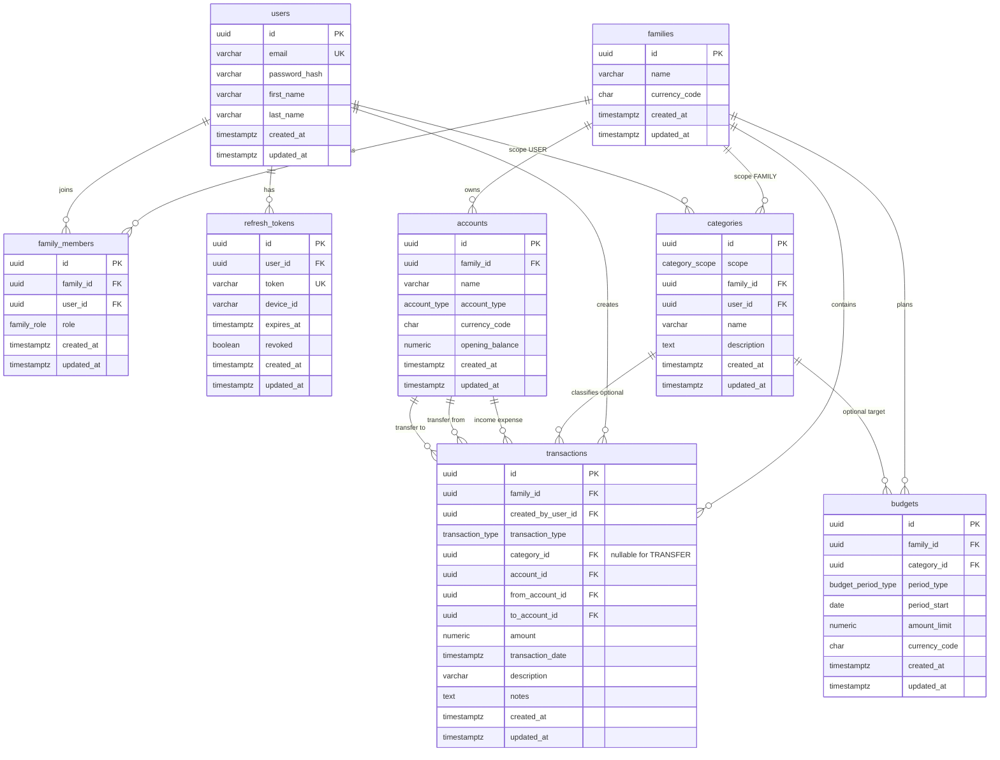

# Phase 2 — Domain Model and Database Design

## Document status

| Item | Value |
|------|--------|
| Phase | 2 — Domain model and database design |
| Supersedes (in part) | `domain-model.md`, `database-design.md` (Income, Expense, Category sections) |
| Preserves | Identity concepts (User, RefreshToken), UTC auditing, soft deletes, UUID PKs, Flyway |
| Out of scope for this phase | Financial goals, goal contributions (deferred to Planning phase), SQL migrations, Java/JPA |

### Revisions (approved)

| # | Change |
|---|--------|
| 1 | Removed unique constraint on `family_members.user_id` — users may belong to multiple families |
| 2 | `TRANSFER` transactions may have `category_id` NULL; `INCOME` and `EXPENSE` require a category |
| 3 | Added `opening_balance NUMERIC(19,4)` to `accounts` (default `0`) |

This design introduces **family-scoped finance**: families, membership roles, multi-account ledgers, scoped categories, unified transactions (including transfers), and family budgets.

---

## 1. Domain design document

### 1.1 Purpose

Expense Manager evolves from single-user income/expense records to a **family-centric financial model**. A **Family** is the primary data boundary for accounts, budgets, and most transactions. **Users** authenticate individually but operate within a family context. **Accounts** hold balances in a declared currency. **Transactions** record income, expenses, and transfers against accounts and categories. **Categories** are classified by scope (system, family, or user). **Budgets** cap spending at the family level over monthly or yearly periods.

### 1.2 Bounded context and modules (target)

| Module | Domain objects (Phase 2 schema) |
|--------|----------------------------------|
| Identity | User, RefreshToken, FamilyMember (membership) |
| Family | Family |
| Ledger | Account, Transaction |
| Category | Category |
| Budget | Budget |

Reporting and Planning (goals) consume Ledger and Category data in later phases.

### 1.3 Aggregates and roots

#### Family (aggregate root)

Represents a household or shared financial unit.

- Has a display name and default currency (`INR` for V1).
- Owns **Accounts** and **Budgets**.
- Has many **FamilyMembers** (users).
- Owns **FAMILY**-scoped categories.
- Owns **Transactions** recorded in family context.

**Invariants**

- At least one member with role `FAMILY_OWNER` must exist before the family is considered operational (enforced at application layer when removing members).
- Default currency code is ISO 4217 (3 letters); V1 default `INR`.

#### User (aggregate root — Identity)

Represents a registered person.

- Authenticates with email and password.
- May belong to **multiple families** via `family_members` (each membership has its own role).
- May create **USER**-scoped categories.
- Creates **Transactions** (audit: `created_by_user_id`).

**Invariants**

- Email unique system-wide.
- A user may have at most one **active** membership row per family: unique (`family_id`, `user_id`) among non-deleted rows.
- API requests that operate on family data must identify which family is in scope (e.g. path parameter or active-family context); authorization verifies membership for that family.

#### FamilyMember (entity — part of Family)

Links User to Family with a role.

| Role | Capabilities (application layer) |
|------|----------------------------------|
| `FAMILY_OWNER` | Manage family settings, members, accounts, family categories, budgets |
| `FAMILY_MEMBER` | Record transactions, manage own user categories, view family data per policy |

#### Account (entity — part of Family)

A financial container belonging to one family (cash, bank, card, loan, investment).

- Has `account_type`, `currency_code` (default `INR`), and `opening_balance` (starting balance when the account is created).
- Target of income/expense postings; source/target of transfers.

**Invariants**

- `family_id` required.
- `currency_code` required (ISO 4217).
- `opening_balance` defaults to `0`; may be positive or negative (e.g. loan accounts).
- Name unique per family among non-deleted accounts (recommended).

#### Category (aggregate root — shared table)

Single table with `category_scope` discriminating visibility.

| Scope | Visibility | Owner columns |
|-------|------------|---------------|
| `SYSTEM` | All families and users | `family_id` NULL, `user_id` NULL |
| `FAMILY` | One family | `family_id` set, `user_id` NULL |
| `USER` | One user | `user_id` set, `family_id` NULL |

**Invariants**

- Scope-specific nullability rules (see §4.3 check constraints).
- System categories are read-only via API (application rule).
- `INCOME` and `EXPENSE` transactions **require** a `category_id`.
- `TRANSFER` transactions **may** omit `category_id` (NULL allowed).
- Category should be compatible with transaction type where applicable (e.g. expense categories for `EXPENSE`; application validation).

#### Transaction (aggregate root — Ledger)

Unified record for `INCOME`, `EXPENSE`, and `TRANSFER`.

| Type | Account fields | Effect (conceptual) |
|------|----------------|---------------------|
| `INCOME` | `account_id` (credited) | Increases account balance |
| `EXPENSE` | `account_id` (debited) | Decreases account balance |
| `TRANSFER` | `from_account_id`, `to_account_id` | Moves value between accounts |

**Invariants**

- Belongs to exactly one `family_id`.
- `category_id` required for `INCOME` and `EXPENSE`; optional (NULL) for `TRANSFER`.
- `amount` > 0 (sign implied by type).
- `transaction_date` required (UTC date or timestamp per API contract; store as `timestamptz` in UTC).
- **Transfer:** `from_account_id` ≠ `to_account_id`; both accounts same `family_id`; both accounts same `currency_code`.
- **Income/Expense:** `from_account_id` and `to_account_id` must be NULL; `account_id` required.

#### Budget (entity — part of Family)

Spending or allocation limit for a family over a period.

- `period_type`: `MONTHLY` or `YEARLY`.
- Optional `category_id` — NULL means family-wide budget; non-NULL means category-specific budget.
- `period_start` anchors the month or year (first day of period in UTC).

**Invariants**

- `family_id` required.
- `amount_limit` > 0.
- Uniqueness: one active budget per (`family_id`, `category_id`, `period_type`, `period_start`) among non-deleted rows.

#### RefreshToken (unchanged concept)

Session per device for JWT refresh; belongs to User.

### 1.4 Derived concepts (not persisted)

| Concept | Source |
|---------|--------|
| Account balance | `opening_balance` + net effect of non-deleted transactions on that account |
| Budget utilization | Sum of `EXPENSE` transactions in period/category vs `amount_limit` |
| Dashboard / reports | Aggregations over transactions, accounts, categories |

### 1.5 Evolution from MVP 1.0 documentation

| Former concept | Phase 2 replacement |
|----------------|---------------------|
| Income table | `transactions` with `type = INCOME` |
| Expense table | `transactions` with `type = EXPENSE` |
| `is_system_category` flag | `category_scope = SYSTEM` |
| User-owned only data | Family-scoped data + family membership |
| User-only authorization | Family membership + role checks |

Financial **Goals** and **Goal Contributions** from earlier docs remain planned for a later phase and are **not** in this schema.

### 1.6 Authorization rules (domain level)

- Every request for family-owned resources must verify the caller is a member of **that** family (users with multiple memberships must select the correct family context).
- Mutations on `FAMILY` scope entities require appropriate role (`FAMILY_OWNER` for structural changes).
- `USER` categories: only the owning user may update/delete.
- `SYSTEM` categories: no user mutation.

---

## 2. ER diagram (text representation)

### 2.1 ASCII overview

```
┌─────────────┐       ┌──────────────────┐       ┌─────────────┐
│   families  │───1:N─│  family_members  │───N:1─│    users    │
└──────┬──────┘       │ (M:N junction)   │       └──────┬──────┘
                       └──────────────────┘
       (users may appear in multiple families)
       │                                                  │
       │1:N                                                │1:N
       ▼                                                  ▼
┌─────────────┐                                  ┌─────────────────┐
│  accounts   │                                  │ refresh_tokens  │
└──────┬──────┘                                  └─────────────────┘
       │
       │1:N (account_id / from / to)
       ▼
┌─────────────┐       N:0..1     ┌─────────────┐
│ transactions│─────────────────│ categories  │
└─────────────┘  (category optional│          │
                  for TRANSFER)    └───────────┘
       │                                │
       │ N:1 (family)                   │ scope: SYSTEM | FAMILY | USER
       └────────────────────────────────┘
       
┌─────────────┐       N:1 (optional)     ┌─────────────┐
│   budgets   │─────────────────────────│ categories  │
└─────────────┘                          └─────────────┘
       │
       N:1
       │
┌─────────────┐
│   families  │
└─────────────┘
```

### 2.2 Mermaid ER diagram



---

## 3. Table definitions

Conventions for all tables:

- Primary key: `id UUID PRIMARY KEY DEFAULT gen_random_uuid()`
- Auditing: `created_at TIMESTAMPTZ NOT NULL DEFAULT now()`, `updated_at TIMESTAMPTZ NOT NULL DEFAULT now()`
- Soft delete (business tables): `is_deleted BOOLEAN NOT NULL DEFAULT false`, `deleted_at TIMESTAMPTZ NULL`
- Requires extension: `pgcrypto` (already enabled in `V1__baseline.sql`)

### 3.1 `families`

| Column | Type | Nullable | Default | Description |
|--------|------|----------|---------|-------------|
| id | UUID | NO | gen_random_uuid() | Primary key |
| name | VARCHAR(100) | NO | — | Family display name |
| default_currency_code | CHAR(3) | NO | INR | ISO 4217; V1 default INR |
| is_deleted | BOOLEAN | NO | false | Soft delete |
| deleted_at | TIMESTAMPTZ | YES | — | Soft delete timestamp |
| created_at | TIMESTAMPTZ | NO | now() | UTC |
| updated_at | TIMESTAMPTZ | NO | now() | UTC |

### 3.2 `users`

| Column | Type | Nullable | Default | Description |
|--------|------|----------|---------|-------------|
| id | UUID | NO | gen_random_uuid() | Primary key |
| email | VARCHAR(255) | NO | — | Unique login |
| password_hash | VARCHAR(255) | NO | — | BCrypt hash |
| first_name | VARCHAR(100) | NO | — | Profile |
| last_name | VARCHAR(100) | NO | — | Profile |
| is_deleted | BOOLEAN | NO | false | Soft delete |
| deleted_at | TIMESTAMPTZ | YES | — | Soft delete |
| created_at | TIMESTAMPTZ | NO | now() | UTC |
| updated_at | TIMESTAMPTZ | NO | now() | UTC |

### 3.3 `family_members`

| Column | Type | Nullable | Default | Description |
|--------|------|----------|---------|-------------|
| id | UUID | NO | gen_random_uuid() | Primary key |
| family_id | UUID | NO | — | FK → families.id |
| user_id | UUID | NO | — | FK → users.id |
| role | family_role | NO | — | FAMILY_OWNER or FAMILY_MEMBER |
| is_deleted | BOOLEAN | NO | false | Soft delete |
| deleted_at | TIMESTAMPTZ | YES | — | Soft delete |
| created_at | TIMESTAMPTZ | NO | now() | UTC |
| updated_at | TIMESTAMPTZ | NO | now() | UTC |

### 3.4 `refresh_tokens`

| Column | Type | Nullable | Default | Description |
|--------|------|----------|---------|-------------|
| id | UUID | NO | gen_random_uuid() | Primary key |
| user_id | UUID | NO | — | FK → users.id |
| token | VARCHAR(512) | NO | — | Unique refresh token value |
| device_id | VARCHAR(100) | YES | — | Client device identifier |
| expires_at | TIMESTAMPTZ | NO | — | Expiration UTC |
| revoked | BOOLEAN | NO | false | Session revoked |
| created_at | TIMESTAMPTZ | NO | now() | UTC |
| updated_at | TIMESTAMPTZ | NO | now() | UTC |

### 3.5 `accounts`

| Column | Type | Nullable | Default | Description |
|--------|------|----------|---------|-------------|
| id | UUID | NO | gen_random_uuid() | Primary key |
| family_id | UUID | NO | — | FK → families.id |
| name | VARCHAR(100) | NO | — | Account label |
| account_type | account_type | NO | — | CASH, SAVINGS, etc. |
| currency_code | CHAR(3) | NO | INR | ISO 4217 per account |
| opening_balance | NUMERIC(19,4) | NO | 0 | Balance before ledger transactions |
| is_deleted | BOOLEAN | NO | false | Soft delete |
| deleted_at | TIMESTAMPTZ | YES | — | Soft delete |
| created_at | TIMESTAMPTZ | NO | now() | UTC |
| updated_at | TIMESTAMPTZ | NO | now() | UTC |

### 3.6 `categories`

| Column | Type | Nullable | Default | Description |
|--------|------|----------|---------|-------------|
| id | UUID | NO | gen_random_uuid() | Primary key |
| scope | category_scope | NO | — | SYSTEM, FAMILY, USER |
| family_id | UUID | YES | — | FK → families.id when scope = FAMILY |
| user_id | UUID | YES | — | FK → users.id when scope = USER |
| name | VARCHAR(100) | NO | — | Category name |
| description | TEXT | YES | — | Optional |
| is_deleted | BOOLEAN | NO | false | Soft delete |
| deleted_at | TIMESTAMPTZ | YES | — | Soft delete |
| created_at | TIMESTAMPTZ | NO | now() | UTC |
| updated_at | TIMESTAMPTZ | NO | now() | UTC |

### 3.7 `transactions`

| Column | Type | Nullable | Default | Description |
|--------|------|----------|---------|-------------|
| id | UUID | NO | gen_random_uuid() | Primary key |
| family_id | UUID | NO | — | FK → families.id |
| created_by_user_id | UUID | NO | — | FK → users.id (audit) |
| transaction_type | transaction_type | NO | — | INCOME, EXPENSE, TRANSFER |
| category_id | UUID | YES | — | FK → categories.id; required for INCOME/EXPENSE, NULL allowed for TRANSFER |
| account_id | UUID | YES | — | FK → accounts.id (INCOME/EXPENSE) |
| from_account_id | UUID | YES | — | FK → accounts.id (TRANSFER) |
| to_account_id | UUID | YES | — | FK → accounts.id (TRANSFER) |
| amount | NUMERIC(19,4) | NO | — | Always positive |
| transaction_date | TIMESTAMPTZ | NO | — | Business date/time UTC |
| description | VARCHAR(255) | YES | — | Short label |
| notes | TEXT | YES | — | Optional |
| is_deleted | BOOLEAN | NO | false | Soft delete |
| deleted_at | TIMESTAMPTZ | YES | — | Soft delete |
| created_at | TIMESTAMPTZ | NO | now() | UTC |
| updated_at | TIMESTAMPTZ | NO | now() | UTC |

### 3.8 `budgets`

| Column | Type | Nullable | Default | Description |
|--------|------|----------|---------|-------------|
| id | UUID | NO | gen_random_uuid() | Primary key |
| family_id | UUID | NO | — | FK → families.id |
| category_id | UUID | YES | — | FK → categories.id; NULL = family-wide |
| period_type | budget_period_type | NO | — | MONTHLY, YEARLY |
| period_start | DATE | NO | — | First day of month or year (UTC date) |
| amount_limit | NUMERIC(19,4) | NO | — | Budget cap |
| currency_code | CHAR(3) | NO | INR | Aligns with family default in V1 |
| is_deleted | BOOLEAN | NO | false | Soft delete |
| deleted_at | TIMESTAMPTZ | YES | — | Soft delete |
| created_at | TIMESTAMPTZ | NO | now() | UTC |
| updated_at | TIMESTAMPTZ | NO | now() | UTC |

---

## 4. Relationships

### 4.1 Cardinality summary

| Parent | Child | Relationship | FK on child |
|--------|-------|--------------|-------------|
| families | family_members | 1:N | family_id |
| users | family_members | 1:N | user_id |
| families | users | M:N | via `family_members` |
| users | refresh_tokens | 1:N | user_id |
| families | accounts | 1:N | family_id |
| families | categories | 1:N (FAMILY scope) | family_id |
| users | categories | 1:N (USER scope) | user_id |
| families | transactions | 1:N | family_id |
| users | transactions | 1:N (creator) | created_by_user_id |
| categories | transactions | 1:N (optional) | category_id (NULL for some TRANSFER rows) |
| accounts | transactions | 1:N | account_id, from_account_id, to_account_id |
| families | budgets | 1:N | family_id |
| categories | budgets | 1:N (optional) | category_id |

### 4.2 Referential integrity

| FK | ON DELETE | Rationale |
|----|-----------|-----------|
| family_members.family_id → families | RESTRICT | Prevent orphan users without family policy |
| family_members.user_id → users | RESTRICT | — |
| refresh_tokens.user_id → users | CASCADE | Remove sessions when user removed (admin) |
| accounts.family_id → families | RESTRICT | — |
| categories.family_id → families | RESTRICT | — |
| categories.user_id → users | RESTRICT | — |
| transactions.family_id → families | RESTRICT | — |
| transactions.created_by_user_id → users | RESTRICT | Preserve audit trail |
| transactions.category_id → categories | RESTRICT | Applies when `category_id` IS NOT NULL |
| transactions.account_id → accounts | RESTRICT | — |
| transactions.from_account_id → accounts | RESTRICT | — |
| transactions.to_account_id → accounts | RESTRICT | — |
| budgets.family_id → families | RESTRICT | — |
| budgets.category_id → categories | RESTRICT | — |

### 4.3 Check constraints (logical — enforce in DB migration phase)

**categories — scope consistency**

| scope | family_id | user_id |
|-------|-----------|---------|
| SYSTEM | NULL | NULL |
| FAMILY | NOT NULL | NULL |
| USER | NULL | NOT NULL |

**transactions — type consistency**

| transaction_type | account_id | from_account_id | to_account_id | category_id |
|------------------|------------|-----------------|---------------|---------------|
| INCOME | NOT NULL | NULL | NULL | NOT NULL |
| EXPENSE | NOT NULL | NULL | NULL | NOT NULL |
| TRANSFER | NULL | NOT NULL | NOT NULL | NULL allowed |

Additional rules:

- `amount > 0`
- TRANSFER: `from_account_id <> to_account_id`
- TRANSFER: from/to accounts must share `family_id` with `transactions.family_id` (application or trigger)
- When `category_id` IS NOT NULL, category must be valid for the transaction’s family/user scope (application validation)

**accounts**

- `opening_balance` is required (default `0`)

**budgets**

- `amount_limit > 0`
- `period_start` must be first day of month when `period_type = MONTHLY`
- `period_start` must be first day of year when `period_type = YEARLY` (application validation)

### 4.4 Uniqueness constraints

| Table | Constraint | Purpose |
|-------|------------|---------|
| users | UNIQUE (email) | Login |
| family_members | UNIQUE (family_id, user_id) WHERE is_deleted = false | One membership per user per family |
| refresh_tokens | UNIQUE (token) | Session lookup |
| accounts | UNIQUE (family_id, name) WHERE is_deleted = false | Avoid duplicate names |
| categories | UNIQUE (name) WHERE scope = SYSTEM AND is_deleted = false | Global system names |
| categories | UNIQUE (family_id, name) WHERE scope = FAMILY AND is_deleted = false | Per-family names |
| categories | UNIQUE (user_id, name) WHERE scope = USER AND is_deleted = false | Per-user names |
| budgets | UNIQUE (family_id, category_id, period_type, period_start) WHERE is_deleted = false | One budget per period |

---

## 5. PostgreSQL enum definitions

Define enums in PostgreSQL before tables that reference them.

```sql
-- Family membership role
CREATE TYPE family_role AS ENUM (
    'FAMILY_OWNER',
    'FAMILY_MEMBER'
);

-- Ledger account classification
CREATE TYPE account_type AS ENUM (
    'CASH',
    'SAVINGS',
    'CURRENT',
    'CREDIT_CARD',
    'LOAN',
    'INVESTMENT'
);

-- Category visibility and ownership
CREATE TYPE category_scope AS ENUM (
    'SYSTEM',
    'FAMILY',
    'USER'
);

-- Unified ledger transaction classification
CREATE TYPE transaction_type AS ENUM (
    'INCOME',
    'EXPENSE',
    'TRANSFER'
);

-- Budget period granularity
CREATE TYPE budget_period_type AS ENUM (
    'MONTHLY',
    'YEARLY'
);
```

**Notes**

- Enum values are uppercase to match existing project enum conventions (`GoalStatus` style).
- Adding enum values later requires `ALTER TYPE ... ADD VALUE` migrations.
- Java mappings will use matching enum names in a later implementation phase.

---

## 6. Index recommendations

### 6.1 Primary and unique indexes

Created automatically by PRIMARY KEY and UNIQUE constraints on:

- All `id` columns
- `users.email`
- `family_members (family_id, user_id)` partial unique (see §4.4)
- `refresh_tokens.token`
- Partial unique indexes for names and budgets (see §4.4)

### 6.2 Foreign key indexes

| Table | Index columns | Purpose |
|-------|---------------|---------|
| family_members | (family_id) | List members of a family |
| family_members | (user_id) | List families for a user |
| family_members | (family_id, user_id) | Membership lookup (covered by unique constraint) |
| refresh_tokens | (user_id) | User sessions |
| accounts | (family_id) | List family accounts |
| categories | (family_id) WHERE scope = FAMILY | Family category lists |
| categories | (user_id) WHERE scope = USER | User category lists |
| transactions | (family_id) | Family transaction history |
| transactions | (created_by_user_id) | User activity audit |
| transactions | (category_id) WHERE category_id IS NOT NULL | Category spending reports |
| transactions | (family_id, transaction_type) WHERE category_id IS NULL AND transaction_type = TRANSFER | Transfers without category |
| transactions | (account_id) | Account statement (income/expense) |
| transactions | (from_account_id) | Transfer source |
| transactions | (to_account_id) | Transfer destination |
| budgets | (family_id) | Family budget list |
| budgets | (category_id) | Category budget lookup |

### 6.3 Query-driven composite indexes

| Table | Index | Typical query |
|-------|-------|----------------|
| transactions | (family_id, transaction_date DESC) | Dashboard, recent activity |
| transactions | (family_id, transaction_type, transaction_date) | Income vs expense reports |
| transactions | (account_id, transaction_date DESC) | Account history |
| transactions | (family_id, category_id, transaction_date) WHERE category_id IS NOT NULL | Category spending in range |
| budgets | (family_id, period_type, period_start) | Active budget for period |
| accounts | (family_id, account_type) | Filter accounts by type |
| categories | (scope) WHERE is_deleted = false | Load system categories |

### 6.4 Partial indexes for soft deletes

For all soft-deleted tables, prefer partial indexes excluding deleted rows:

```sql
-- Example pattern (document only)
CREATE INDEX ... ON transactions (family_id, transaction_date)
  WHERE is_deleted = false;
```

Apply the same pattern to `accounts`, `categories`, `budgets`, and `family_members` for list endpoints.

---

## 7. Migration sequencing plan

### 7.1 Current state

| Version | Description | Status |
|---------|-------------|--------|
| V1 | `pgcrypto` extension baseline | Applied in Phase 1 |

No business tables exist yet.

### 7.2 Sequencing principles

1. **Enums before tables** that reference them.
2. **Independent parents before children** (families, users before members).
3. **Seed data in dedicated migrations** after table creation (system categories for INCOME/EXPENSE; Transfer category optional).
4. **One logical concern per migration** for easier rollback and review.
5. **No SQL in this document** — filenames and scope only.

### 7.3 Planned migration sequence

| Order | Suggested Flyway version | Scope | Depends on |
|-------|--------------------------|-------|------------|
| 1 | V1 | Extension `pgcrypto` | — (exists) |
| 2 | V2 | Create all PostgreSQL enums (§5) | V1 |
| 3 | V3 | `families` table | V2 |
| 4 | V4 | `users` table | V2 |
| 5 | V5 | `family_members` table + FKs + unique (`family_id`, `user_id`) partial index | V3, V4 |
| 6 | V6 | `refresh_tokens` table + FKs | V4 |
| 7 | V7 | `accounts` table (`opening_balance` default 0) + FKs + indexes | V3 |
| 8 | V8 | `categories` table + scope check constraints + indexes | V3, V4 |
| 9 | V9 | Seed `SYSTEM` categories (Food, Transport, Salary, etc.) | V8 |
| 10 | V10 | `transactions` table + type/category check constraints + indexes | V3, V4, V7, V8 |
| 11 | V11 | `budgets` table + uniqueness + indexes | V3, V8 |

### 7.4 Optional follow-up migrations (later phases)

| Version | Scope |
|---------|--------|
| V12+ | `financial_goals`, `goal_contributions` (Planning module) |
| V13+ | Reporting views or materialized views (if needed) |
| V14+ | `updated_at` trigger function (if not using JPA `@UpdateTimestamp` only) |

### 7.5 Data migration note (MVP → Phase 2)

If any environment had early `income` / `expense` tables from a superseded design, a one-off migration would map rows into `transactions` and old categories into `categories` with appropriate `scope`. Greenfield installs skip this step.

### 7.6 Rollback strategy

- Flyway undo is not assumed; roll forward with corrective migrations.
- Destructive changes require new versioned scripts and backup before apply in shared environments.

---

## 8. Seed data recommendations (V9 — reference only)

System categories (scope `SYSTEM`), examples:

| name | Typical use |
|------|-------------|
| Food | EXPENSE |
| Transportation | EXPENSE |
| Shopping | EXPENSE |
| Entertainment | EXPENSE |
| Healthcare | EXPENSE |
| Education | EXPENSE |
| Salary | INCOME |

A system **Transfer** category is **optional** — transfers may use `category_id` NULL.

---

## 9. Alignment checklist with technical requirements

| Requirement | Design response |
|-------------|-----------------|
| PostgreSQL | All tables PostgreSQL-native types |
| Flyway | Sequencing plan §7 |
| UUID PKs with `gen_random_uuid()` | Default on all `id` columns §3 |
| Currency on accounts | `accounts.currency_code`, default `INR` |
| V1 default currency INR | `families.default_currency_code`, `accounts.currency_code`, `budgets.currency_code` default INR |
| Families | `families`, `family_members` |
| Family roles | `family_role` enum |
| Multiple accounts per family | `accounts.family_id` |
| Account types | `account_type` enum |
| Single categories table | `categories` with `category_scope` |
| Category scopes | SYSTEM, FAMILY, USER |
| Transactions INCOME/EXPENSE/TRANSFER | `transactions.transaction_type` |
| Category per transaction | Required for INCOME/EXPENSE; optional (NULL) for TRANSFER |
| Account opening balance | `accounts.opening_balance NUMERIC(19,4)` default 0 |
| Multi-family users | `family_members` without unique `user_id`; unique per (`family_id`, `user_id`) |
| Account-to-account transfers | `from_account_id`, `to_account_id` |
| Family budgets | `budgets.family_id` |
| MONTHLY / YEARLY periods | `budget_period_type` enum + `period_start` |

---

## 10. Related documentation

* [domain-model.md](domain-model.md) — superseded in part; update when implementing
* [database-design.md](database-design.md) — superseded in part; update when implementing
* [architecture.md](architecture.md) — module boundaries to extend
* [decisions.md](decisions.md) — add DECISION-017+ when accepting this design
* [project-roadmap.md](project-roadmap.md) — roadmap may be reordered after this phase
